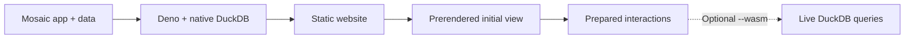

# Mosaic Static

Publish Mosaic applications as static websites with prerendered views and
working interactions. Deno runs the application and native DuckDB at build time.
Visitors see the initial view immediately and explore prepared results without a
database.

Optionally, load DuckDB-WASM in the background and switch to live queries when
it is ready, preserving the current view and selections.



## Try it

Requires Deno with `deno bundle`, validated with Deno 2.9.5. Build modules are
trusted code running with `-A` permissions. The first build downloads native
dependencies and DuckDB's nanoarrow extension.

```sh
deno task demo
deno task demo:weather
deno task serve
```

Open [Flight patterns](http://127.0.0.1:8000/flights/) or
[Seattle weather](http://127.0.0.1:8000/weather/).

- **Flights:** 231,083 records, three linked histograms, range presets, and
  summaries. Based on Mosaic's cross-filtering example.
- **Weather:** 1,461 daily observations, season and year filters, weather-type
  selection, a canvas scatterplot, point inspection, and ranked days. Uses
  custom Mosaic clients.

Both use checked-in datasets.
[Example guide and data sources](docs/examples.md).

## Build your app

```sh
deno task build examples/flights/build.ts --out dist/site
```

An application module defines its views and finite interaction domains. A build
module prepares its data using an injected `@duckdb/node-api` connection. The
same Mosaic queries run during server rendering, prepared replay, and optional
WASM execution. [Application API](docs/api.md).

The output directory can be served by an ordinary HTTP server, including from a
nested URL. Initial HTML and SVG are prerendered by default, with canvas output
embedded as images. Use `--no-prerender` to omit the initial preview.

### Enable background DuckDB

```sh
deno task build examples/flights/build.ts --out dist/flights-wasm --wasm
```

Prepared interactions remain available while the local WASM runtime and data
load. The flights example then enables free-form brushing. If loading fails,
prepared interactions remain usable. This option includes the source tables in
the published directory, alongside the runtime and worker.

Use `--replace` to rebuild an existing export. Run `deno task build --help` for
CLI options.

## Documentation

- [Application API, rendering contract, and CLI](docs/api.md)
- [Examples and validation](docs/examples.md)
- [Architecture and source analysis](docs/architecture.md)
